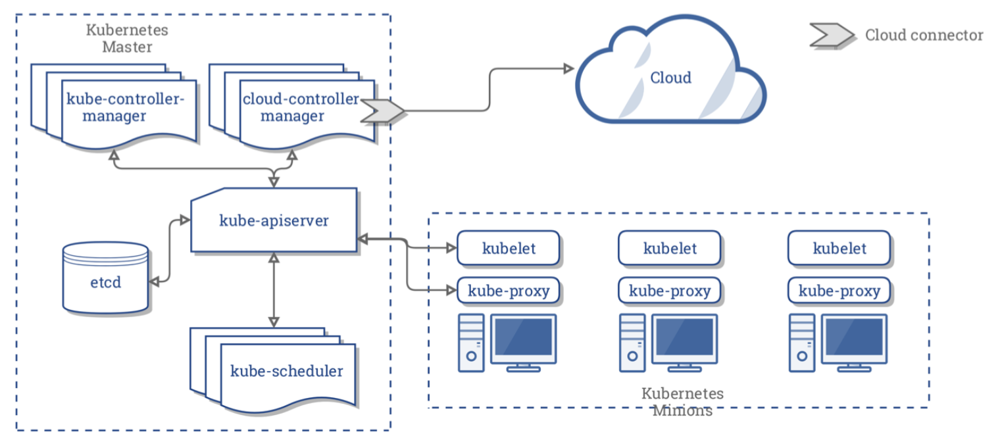
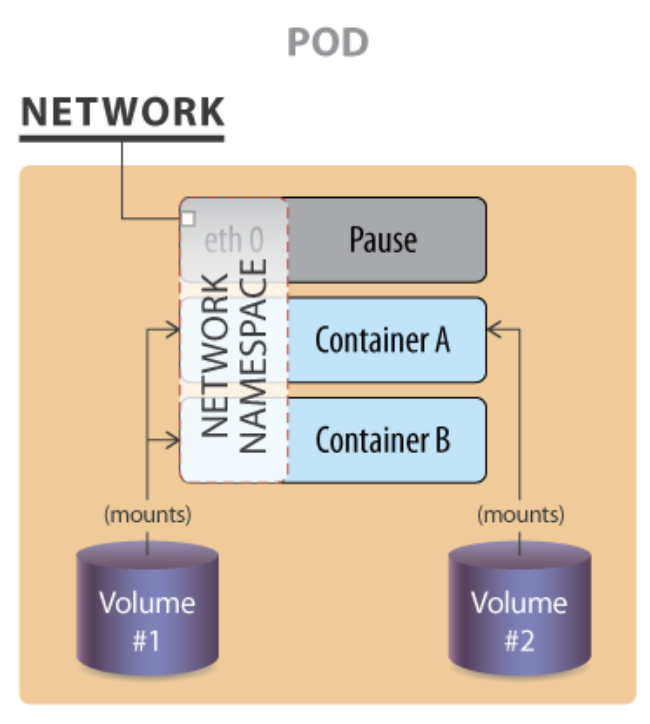

# Chapter 4

A Kubernetes cluster is made of by 2 type of nodes: **Masters** and **Workers**

There are many agents in the master nodes, the primary one and central to the cluster is the **kube-apiserver**. The cluster is all driven by API calls to controllers (internal and external). All other agents send the requests to the API server which authenticate and authorize, and sends them where they need to go. It's also responsible for the persisten state of the DB (**etcd**). Only kube-apiserver talks to etcd.



The **kube-scheduler** uses an algorithm to determine which node will host a pod, then try to deploy the pod bsed on availability and success. Here is the code of the [scheduler](https://github.com/kubernetes/kubernetes/blob/master/pkg/scheduler/scheduler.go) on Github for more information.

The **etcd** database is a b+tree key-value store used to persist the cluster state. A new value does not replace the previous one, it's marked for future removal. It works with curl through and API. The etcd cluster is made of a master and follower nodes, there is an algorithm to identify which node takes the master role.

The **kube-controller-manager** is a loop that interacts with the API server to determine the state of the cluster. If the state does not match, it contacts the controller to match the required state. Some of these controllers are: endpoints, namespaces and replicaSet. Kubernetes ship some controllers and you can create your own.

Agent **kubelet** is the primary agent on the worker nodes. It does all local configuration that it gets from the kube-apiserver such as deploy controllers, pods and download images. It sends back status to the API server which save it to the DB. It also interacts with Docker or other container engine such as rtk to make sure the containers are running. The Pods specifications, a **PodSpec**, is a JSON or YAML that describes the pod. 

The **kube-proxy** is in charge of manage the network connectivity to the containers using iptable entries. It also uses the userspace mode to monitor Services and Endpoints using a random port to proxy traffic and ipvs.

**Supervisord** is used to monitor kubelet and docker containers. So it will restart them if they fail.

There isn't a centralized logging for Kubernetes but **Fluentd** can be used/implemented to provide centralized logging.

A **Pod** is the smallest unit in a cluster. A Pod is contain one or more containers but Kubernetes does not interact with them, just with the Pod. The Pod follows the architectural design of having one process per container.



The picture have 2 containers (A & B) and 2 volumes (1 & 2). There is a 3rd container named **Pause container** used to get the IP address of the Pod.

The containers in a Pod starts in parallel. There is only one IP address per Pod, and it's shared among all the containers in the pod. So the communication between containers can be done thru IPC, loopback interface or shared filesystem.

When there is second (or more) container in a Pod serving the main container, this secondary containers are call **sidecars**. Examples of sidecars are those used for logging or proxying.

Two detailed explanaition about **Kubernetes Networking** can be found [here](https://kubernetes.io/docs/concepts/cluster-administration/networking/) and [here](https://speakerd.s3.amazonaws.com/presentations/005d36f0113d4773be8866496142485e/Illustrated_guid_to_kubernetes_networking.pdf). From a network perspective a Pod is like a VM of a physical host. Besides assign an IP to the Pod, there are also traffic routes between all Pods on any node. 

There are 3 network challenges to solve:

1. Container to container communication: Solved by the Pod concept
2. Pod to pod communication: Solved by the Kubernetes user (admin or developer) has to do 
3. External to pod communication: Solved by the Service concept

#### **(1) Container to container communication**

Kubernetes containers networking is standardized by the [Container Network Interface](https://github.com/containernetworking/cni) (CNI). CNI is a framework to write plugins to configure container networking and remove resources when the container is deleted. There are many plugins for different platforms. CNI is the default network interface mechanism if you install Kubernetes with kubeadm.

This is an example of a network configuration file to define a standard Linux **bridge** (*cni0*) with an IP in the subnet **10.22.0.0/16** in the right namespace.

```json
{
    "cniVersion": "0.2.0",
    "name": "mynet",
    "type": "bridge",
    "bridge": "cni0",
    "isGateway": true,
    "ipMasq": true,
    "ipam": {
        "type": "host-local",
        "subnet": "10.22.0.0/16",
        "routes": [
            { "dst": "0.0.0.0/0" }
         ]
    }
}
```

#### **(2) Pod to pod communication:**

The pod to pod communication is not solved by Kubernetes and it's requirements are:

1. All pods can communicate with each pod across nodes.
2. All nodes can communicate will all pods
3. No Network Address Translation (NAT)

All IP's are routable without NAT using the physical network infrastructure (if you have access) or with a software such as:

- [Weave](https://www.weave.works/)
- [Flannel](https://github.com/coreos/flannel)
- [Calico](https://www.projectcalico.org/)
- [Romana](https://romana.io/)

A complete list can be found [here](https://kubernetes.io/docs/concepts/cluster-administration/networking/) or [here](https://kubernetes.io/docs/concepts/cluster-administration/addons/).

Other clustering systems such as [Mesos](http://mesos.apache.org/) are very simmilar to Kubernetes, using different tools for the same purpose, for example ZooKeeper vs etcd,  but the difference is that Kubernetes is fault-tolerant, self-discovery and scaling, all API-driven. ([Mesos Architecture](http://mesos.apache.org/documentation/latest/architecture/#mesos-architecture))

In the resource section of the PodSpec you can pass parameters to the container, for example:

```yaml
resources:
  limits:
    cpu: "1"
    memory: "4Gi"
  requests:
    cpu: "0.5"
    memory: "500Mi"
```

This can also be done using a **ResourceQuota** object set in the namespace.

#### **(3) External to pod communication:**

A **Service** is a scalable and flexible agent that connects decoupled resources, it will reconnect if something die and is replaced. The Service also handle traffic, such as **NodePort** or **LoadBalance** to distrubute inbound requests among the pods. It also handles access policies, useful for resource control and security.

## Lab 4.1 [Working with CPU and Memory Constraints](https://lms.quickstart.com/custom/858487/LAB_4.1.pdf)

Using the [Vagrantfile](Lab_03/Vagrantfile) from previous Lab, startup a Kubernetes cluster to deploy an application with custom memory limits:

```bash
mkdir -p Lab04/shared_folder
cp Lab03/Vagrantfile Lab04/Vagrantfile
cd Lab04
vagrant up
export KUBECONFIG=shared_folder/remote_config
kubectl get nodes
kubectl get pods --all-namespaces
```

When the cluster is up and running create a deployment for the application and remove any `creationTimestamp` and `status` settings:

```bash
kubectl run hog --image=vish/stress --dry-run -o yaml | sed \
    -e '/creationTimestamp/d' \
    -e '/status/d' > hog.yaml
```

Add the memory limits and requirements replacing the line `resources: {}` by the following 4 lines:

```yaml
        resources:
          limits:
            memory: "4Gi"
          requests:
            memory: "2500Mi"
```

Deploy the application and view the container stdio (logs) to see how much memory has been allocated:

```bash
kubectl apply -f hog.yaml
pod=$(kubectl describe pod hog | grep ^Name: | cut -f2 -d: | tr -d ' ')
kubectl logs $pod
```

Output:

```
I1022 01:11:01.755693       1 main.go:26] Allocating "0" memory, in "4Ki" chunks, with a 1ms sleep between allocations
I1022 01:11:01.755775       1 main.go:29] Allocated "0" memory
```

Open 2 extra terminals to watch the resources of the master and worker node with command `top`:

```bash
# On terminal (2)
vagrant ssh master -c 'top'
# On terminal (3)
vagrant ssh worker -c 'top'
```

Edit the `hog.yaml` deployment file to consume CPU and Memory:

```yaml
        resources:
          limits:
            cpu: "1"
            memory: "4Gi"
          requests:
            cpu: "0.5"
            memory: "500Mi"
        args:
        - -cpus
        - "2"
        - -mem-total
        - "950Mi"
        - -mem-alloc-size
        - "100Mi"
        - -mem-alloc-sleep
        - "1s"
```

Apply the changes, see the logs and the output of `top` command:

```bash
kubectl apply -f hog.yaml
pod=$(kubectl get pods | grep hog- | grep 'ContainerCreating' | cut -f1 -d' ')
sleep 10s
kubectl logs $pod
```

Output:

```
I1022 01:38:27.943769       1 main.go:26] Allocating "950Mi" memory, in "100Mi" chunks, with a 1s sleep between allocations
I1022 01:38:27.943809       1 main.go:39] Spawning a thread to consume CPU
I1022 01:38:27.943819       1 main.go:39] Spawning a thread to consume CPU
I1022 01:38:40.382556       1 main.go:29] Allocated "950Mi" memory
```

If you don't see something similar, execute `kubectl logs $pod` again or review the deployment manifest. Also, the `stress` process should go to the top at the `top` output at the worker node.

The final solution of this Lab is in the [`hog.yaml`](Lab_04/hog.yaml) file. 

## Lab 4.2 [Resource Limits for a Namespace](https://lms.quickstart.com/custom/858487/LAB_4.2.pdf)

It's also possible to set limits to an entire namespace. 

Create a namespace:

```bash
kubectl create namespace low-usage-limits
kubectl get namespace
```

Create the following manifest file `low-resource-range.yaml` with the object `LimitRange`:

```yaml
apiVersion: v1
kind: LimitRange
metadata:
  name: low-resource-range
spec:
  limits:
  - default:
      cpu: 1
      memory: 500Mi
    defaultRequest:
      cpu: 0.5
      memory: 100Mi
    type: Container
```

And assign it to the created namespace. Remember every command requires a namespace, if it is not specified the default one is `default`. The `kubectl` command does not (won't ever) allow to use [multiple namespaces](https://github.com/kubernetes/kubernetes/issues/52326) in a query: it's one (`-n NAME`) or all (`--all-namespaces`). 

```bash
kubectl apply -f low-resource-range.yaml -n low-usage-limits
kubectl get LimitRange --all-namespaces
kubectl get LimitRange
```

Deploy the original hog, the one without any limitations, and view the deployment manifest:

```bash
kubectl run limited-hog --image vish/stress -n low-usage-limits
kubectl get deployment 
kubectl get deployment --namespace low-usage-limits
kubectl get pods -n low-usage-limits
pod=$(kubectl get pods -n low-usage-limits | grep hog- | cut -f1 -d' ')
kubectl get pod $pod -n low-usage-limits
kubectl get pod $pod -n low-usage-limits -o yaml | grep  resources: -A7 -B5
```

There you'll see the following lines:

```yaml
spec:
  containers:
  - image: vish/stress
    imagePullPolicy: Always
    name: limited-hog
    resources:
      limits:
        cpu: "1"
        memory: 500Mi
      requests:
        cpu: 500m
        memory: 100Mi
    terminationMessagePath: /dev/termination-log
```

The original deployment, deployed into `default` namespace, is not limited but if it's deployed into the limited namespace, it will inherit the limits.

Let's duplicate the deployment `hog` from `default` into the new and limited namespace. Create a copy of `hog.yaml` adding the line `namespace: low-usage-limit` in the `metadata` section.

```bash
awk '/^  name:/ && !n { print "  namespace: low-usage-limits"; n=1} 1' hog.yaml > hog-low-usage-limits.yaml
head hog-low-usage-limits.yaml
```

Output:

```yaml
apiVersion: apps/v1beta1
kind: Deployment
metadata:
  labels:
    run: hog
  namespace: low-usage-limits
  name: hog
spec:
  replicas: 1
```

And deploy it:

```bash
kubectl apply -f hog-low-usage-limits.yaml
kubectl get deployments --all-namespaces
```

Checking the resource limits of the latest deployed pod, it didn't inherited the namespace limitations. This is because the depoyment defined it's own limitations.

```bash
pod=$(kubectl get pods -n low-usage-limits | grep '^hog-' | cut -f1 -d' ')
kubectl get pod $pod -n low-usage-limits -o yaml | grep resources: -A7 -B3
```

Output:

```yaml
    image: vish/stress
    imagePullPolicy: Always
    name: hog
    resources:
      limits:
        cpu: "1"
        memory: 4Gi
      requests:
        cpu: 500m
        memory: 500Mi
    terminationMessagePath: /dev/termination-log
```

Compared with the `hog` pod at `default` it has the same resources. Compared with the resources of `limited-hog` at `low-usage-limits` it has different resources.

If you have more than one worker, the latest deployed pod will be assigned to the non-stressed worker but if you have just one, you'll see several errors and restarts between both `hog` pods as they race for the same pool of resources. When the one in `default` is restarted, the other in `low-usage-limits` does not have enough resources available in the system so it fail and it's restarted, then the one in `default` fail and the story is repeated forever.

To watch this, execute:

```bash
watch -n 0.2 kubectl get pods --all-namespaces -o wide
```

Cleanup the cluster deleting all the deployments:

```bash
kubectl delete deployment hog
kubectl delete deployment hog -n low-usage-limits
kubectl delete deployment limited-hog -n low-usage-limits
kubectl delete namespace low-usage-limits
```

## Lab 4.3 [More Complex Deployments](https://lms.quickstart.com/custom/858487/LAB_4.3.pdf)

This example deploy a microservice application demo, a sock shopping site, from https://github.com/microservices-demo/microservices-demo/tree/master/deploy/kubernetes

The deployment manifest URL is: https://raw.githubusercontent.com/microservices-demo/microservices-demo/master/deploy/kubernetes/complete-demo.yaml, so you either download it or apply it from GitHub but first ...

Identify the application namespace and creates them:

```bash
curl -sSL https://raw.githubusercontent.com/microservices-demo/microservices-demo/master/deploy/kubernetes/complete-demo.yaml | grep namespace: | sort | uniq

namespace=$(curl -sSL https://raw.githubusercontent.com/microservices-demo/microservices-demo/master/deploy/kubernetes/complete-demo.yaml | grep namespace: | sort | uniq | cut -f2 -d: | tr -d ' ')

kubectl create namespace $namespace
kubectl get namespaces
```

It should create the namespace `sock-shop`, now deploy it.

```bash
kubectl apply -f https://raw.githubusercontent.com/microservices-demo/microservices-demo/master/deploy/kubernetes/complete-demo.yaml -n sock-shop
```

In a second terminal, execute:

```bash
watch -n 0.2 kubectl get pods -n sock-shop -o wide
```

Verify the services are been exposed:

```bash
kubectl get service -n sock-shop
```

To access the application follow the instructions from Lab 03 to forward the port `8080` to the `front-end` service:

```bash
port=$(kubectl get service front-end -n sock-shop -o jsonpath='{.spec.ports[0].nodePort}')
PORTS="8080>${port}" vagrant reload
curl http://localhost:8080
```

It may take some time, and maybe several tries of the `curl` command but when it's ready, go to http://localhost:8080.

To know which node is running the containers (not pods) let's execute `docker ps` on every node: masters and workers.

```bash
vagrant ssh master -c 'sudo docker ps'
vagrant ssh worker -c 'sudo docker ps'
```

To destroy the application you have to list all the deployments and delete them all, when no resources are found, use the `docker ps` command to identify the alive containers. If there are a huge list, use the command `wc -l` to get the count, so you'll know if they number of containers is decreasing. 

Deleting the pods won't cause any termination. If a pod is deleted the scheduler identify that the current state does not match with the expected and will re-create the missing pods.

A more efective way to delete the container is to use the same manifest used to create it. Just execute:

```bash
kubectl delete -f https://raw.githubusercontent.com/microservices-demo/microservices-demo/master/deploy/kubernetes/complete-demo.yaml
```